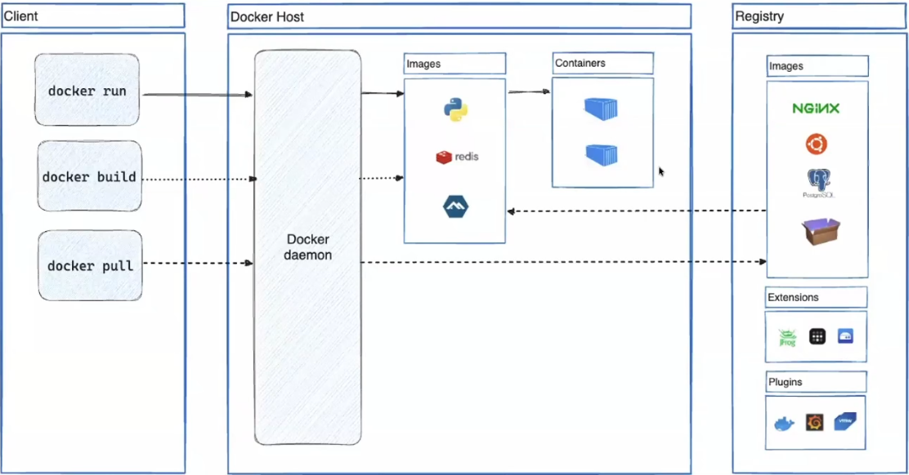
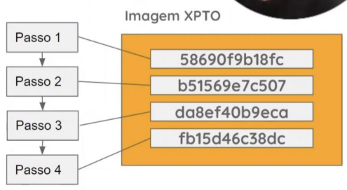
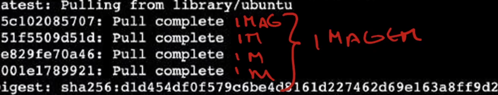

# O que é o Docker?

Para responder essa pergunta primeiro, você precisa entender o que são Containers.

## Container

Containers são tipo uma máquina virtual, tem o sistema operacional e tudo mais, só que, diferente das máquinas virtuais, eles não simulam o computador inteiro, mas sim criam um ambiente isolado que finge ser uma máquina virtual.

Geralmente, esses containers também rodam a versão mais enxuta possível do software. Teoricamente, você pode instalar um sistema operacional como o Ubuntu com tudo que tem direito em um container, mas o que os profissionais costumam fazer é construir uma versão mais leve do sistema operacional, que só faz uma coisa.

É uma unidade padrão de software que empacotam componentes de software em um sistema de arquivos completo, que contem TUDO necessário para a execução: códito, runtime, ferramentas de sistema - qualquer coisa que possa ser instalada em um servidor. isso garante que o software sempre irá executar da mesma forma, independente do seu ambiente.

### Caracterizando um container

Um container será um ambiente de virtualização

* Com menos consumo de processamento
* Com menor custo de manutenção e configuração
* Com menor tempo de inicialização e finalização


Contêiner: instância de uma imagem do docker

## Docker

Docker é uma forma de construir e rodar esses containers, salvar em templates, etc...

Ele é uma plataforma de código aberto que usa contêiners para empacotar aplicações e suas dependências, garantindo que elas sejam executadas de forma consistente em qualquer ambiente. O Docker permite que os desenvolvedores criem, testem e implantem aplicativos de maneira rápida e eficiente, independentemente do sistema operacional ou infraestrutura subjacente.




* ### Client - interface de linha de comando para interagir com o docker host

 Os comandos do Docker são usados para criar, gerenciar e interagir com contêineres e imagens. Eles permitem que os desenvolvedores construam, testem e implantem aplicativos de maneira rápida e eficiente, independentemente do sistema operacional ou infraestrutura subjacente.


* ### Docker Host - onde os containers rodam

O docker host é o ambiente onde os contêineres são executados. Ele pode ser um servidor físico, uma máquina virtual ou um serviço de nuvem. O Docker host é responsável por gerenciar os recursos do sistema e garantir que os contêineres sejam executados de forma eficiente.

* ### Registry - repositório de imagens 

O registry é um repositório de imagens do Docker, onde os desenvolvedores podem armazenar e compartilhar suas imagens. O [Docker Hub](https://hub.docker.com/) é o registro público mais popular, mas também existem registros privados que as empresas podem usar para armazenar suas imagens de forma segura.

## Imagem
A imagem Docker é basicamente uma série de instruções que o Docker segue para criar um container. Em seguida, com o container criado, o Docker irá executá-lo.

As imagens são armazenadas de forma local, porém elas também podem ser armazenadas e distribuídas através de um docker registry, como o [Docker Hub](https://hub.docker.com/) ou um registro privado. 

As imagens são construídas em camadas, onde cada camada representa uma modificação ou adição feita à imagem base. Isso permite que as imagens sejam reutilizadas e compartilhadas de forma eficiente, economizando espaço de armazenamento e tempo de download.

Em outras palavras, as imagens contêm uma sequência de passos que vão ditar o comportamento de um container.






* Imagem = classe

*  container = objeto

## Comandos básicos do Docker

### Container

| Comando | Descrição |
| --- | --- |
| docker container run | inicia um container a partir de uma imagem |
| docker container ls | lista os containers em execução |
| docker container ls -a | lista todos os containers, incluindo os parados |
| docker container stop | para um container em execução |
| docker container start | inicia um container parado |
| docker container rm | remove um container |
| docker container exec | executa um comando em um container em execução |

### Image
| Comando | Descrição |
| --- | --- |
| docker image build | constrói uma imagem a partir de um Dockerfile |
| docker image rm | remove uma imagem |
| docker image pull | baixa uma imagem do repositório |
| docker image push | envia uma imagem para o repositório |


### Flags importantes

| Flag | Descrição |
| --- | --- |
| --name | dá um nome ao container |
| -it | roda o container em modo interativo, permitindo acesso ao terminal do container |
| -di | roda o container em segundo plano, liberando o terminal (detached mode) |
| -p | mapeia as portas do container para as portas do host |
| --rm | remove o container automaticamente após a execução |
| -e | define variáveis de ambiente para o container |
| -v | monta um volume para persistência de dados |

##### **detached mode:** modo em que o container roda em segundo plano, permitindo que o terminal seja liberado para outras tarefas. O container continua rodando mesmo após o terminal ser fechado. Para acessar o terminal do container em detached mode, é necessário usar o comando "docker exec -it <container_name> bash" ou "docker attach <container_name>".

##### **Dica:** *Use docker container rm -f [id do container]* para forçar a remoção de um container que está em execução. Cuidado: isso interrompe o processo imediatamente!


## Dockerfile

### Exemplo de um Dockerfile
```dockerfile

FROM ubuntu:22.04 
RUN apt-get update && \
    apt-get install python3.11 python3.11-dev python3-pip -y
WORKDIR /app
COPY . .
RUN pip3 install --no-cache-dir -r requirements.txt
EXPOSE 8000
ENV NAME="Rodrigo Vasco"
ENV IDADE=25
ENV EMAIL="rodrigovasco.dev@gmail.com"
CMD ["python3.11", "app.py"]


```

## Assuntos extras para estudar

### Orquestradores de contêineres
- **Docker Swarm:** ferramenta de orquestração de contêineres do Docker, que permite gerenciar um cluster de hosts Docker e implantar aplicativos em contêineres de forma escalável e resiliente.

- **Kubernetes:** plataforma de código aberto para automação de implantação, dimensionamento e gerenciamento de aplicativos em contêineres, que suporta uma ampla variedade de ferramentas de contêinerização, incluindo o Docker. O Kubernetes é amplamente utilizado para orquestrar e gerenciar aplicativos em contêineres em ambientes de produção.


## Links úteis
- [Docker](https://www.docker.com/)
- [Docker Hub](https://hub.docker.com/)
- [Apostila Docker](Apostila/apostila-docker.pdf)
- [Drive do curso de férias - Leonardo Farias ](https://drive.google.com/drive/folders/1DIxNvbIVoWfdM8F7yi9JtDlOFHs8QgtM)

### Aulas/Cursos

- [Docker do zero - Fernanda Kipper](https://www.youtube.com/watch?v=DdoncfOdru8&t=2s)

- [Curso Docker Essencial: Primeiros Passos - TechEduca](https://www.youtube.com/watch?v=OERbOJZwGAU&list=PLViOsriojeLrdw5VByn96gphHFxqH3O_N)

- [Docker compose - Fernanda Kipper](https://www.youtube.com/watch?v=D_ha0g9yS2E)